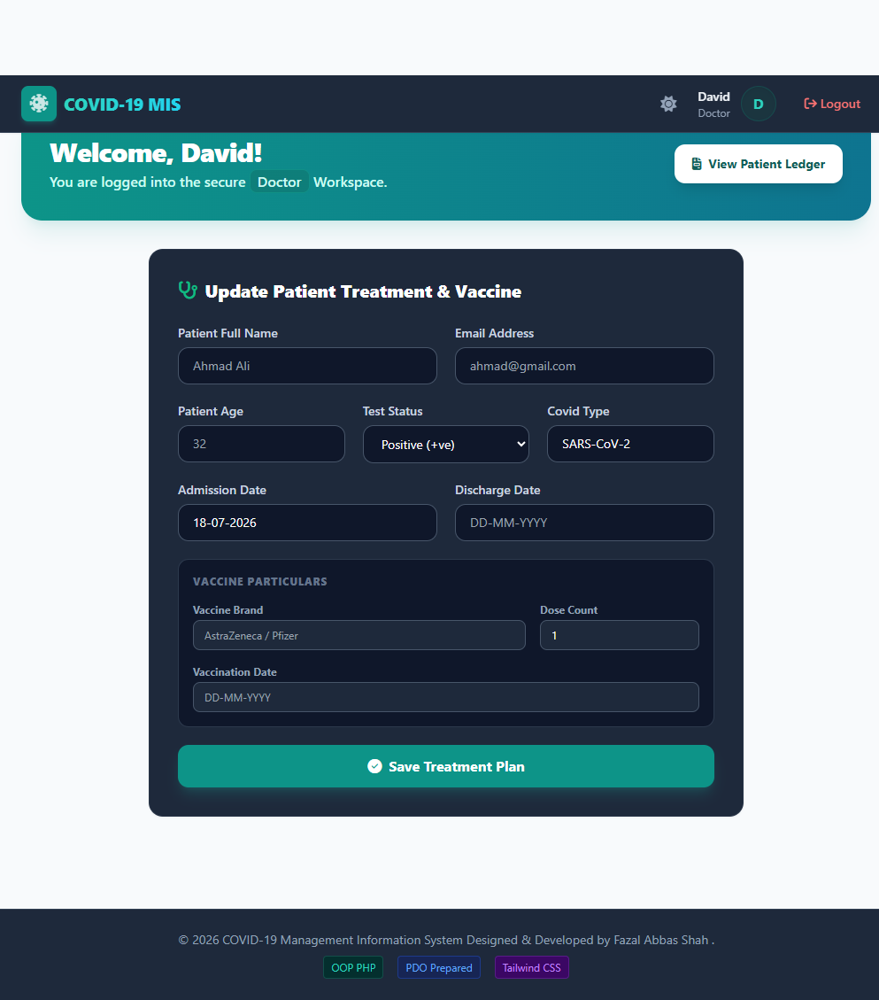
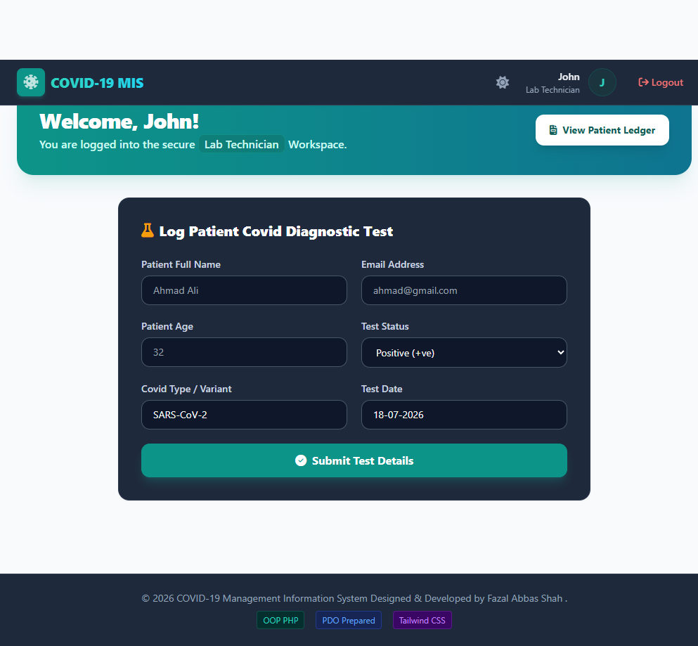
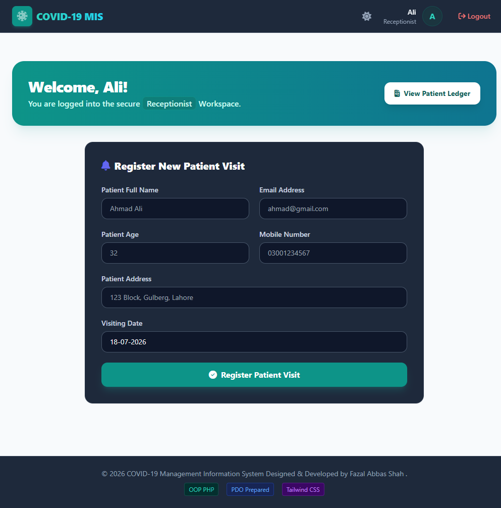
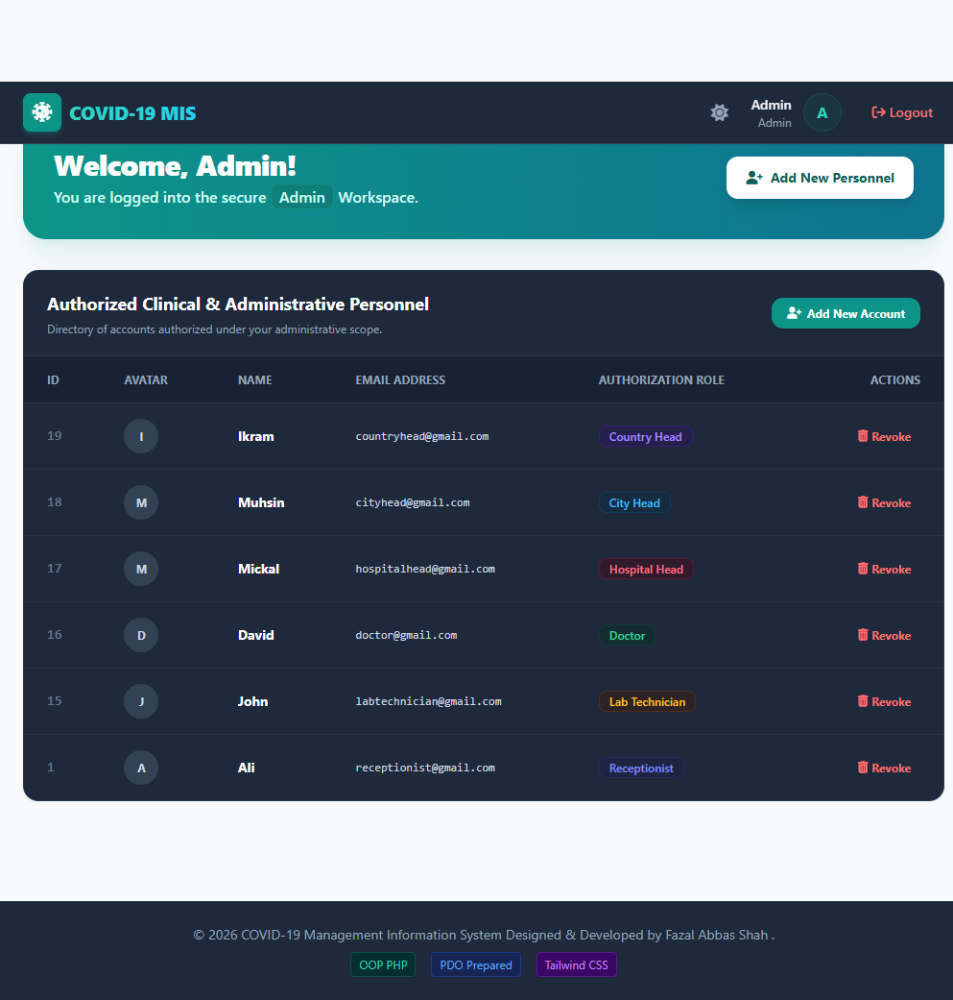
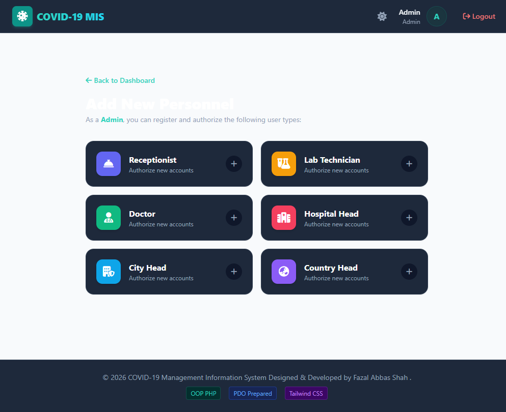
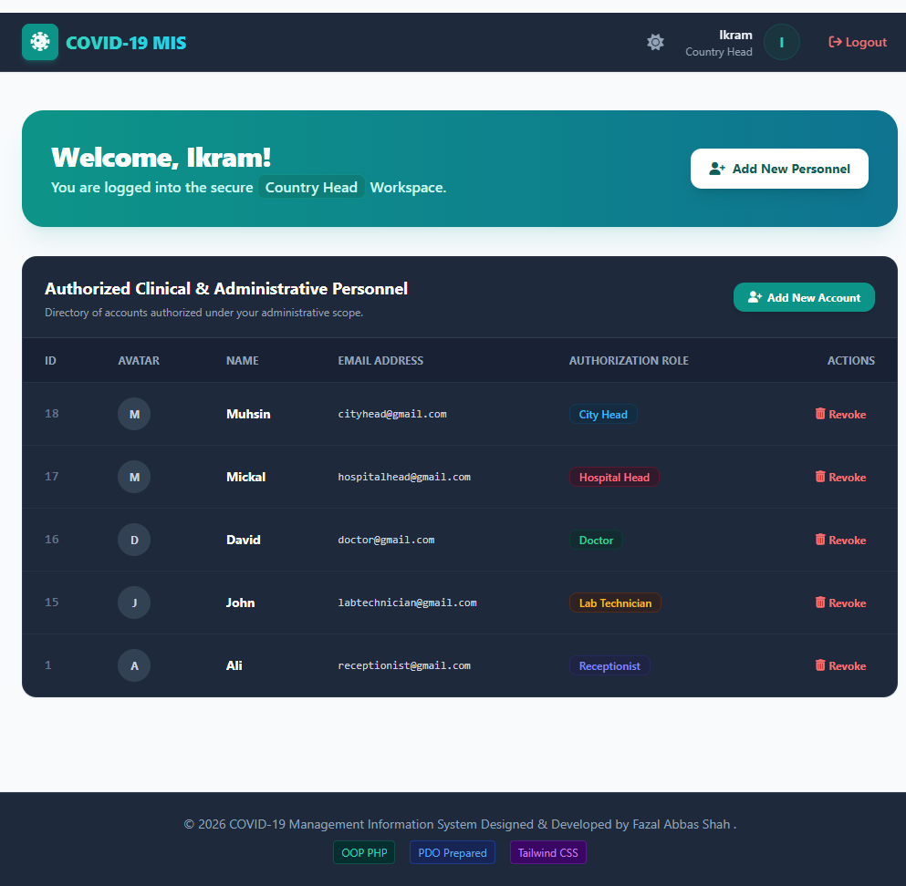
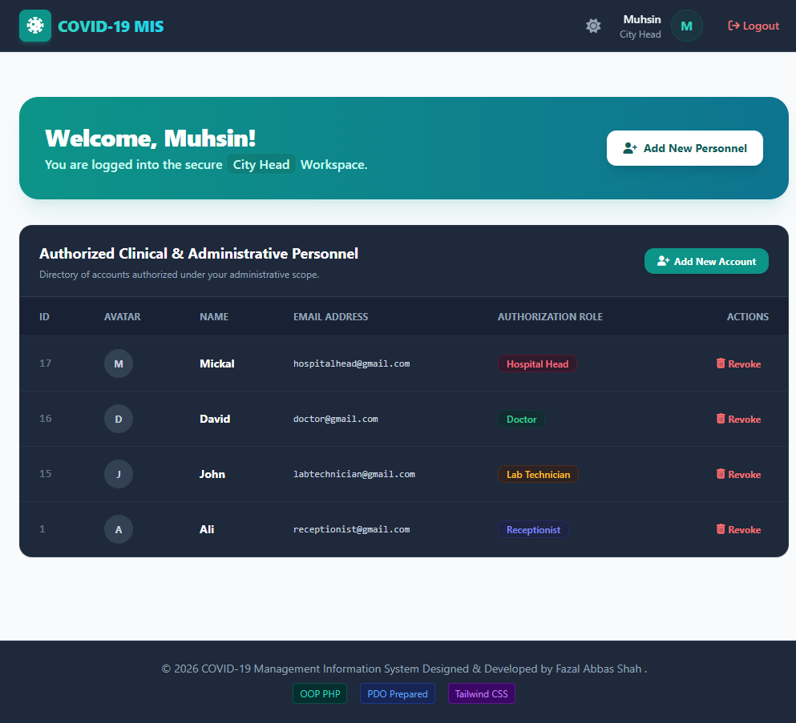
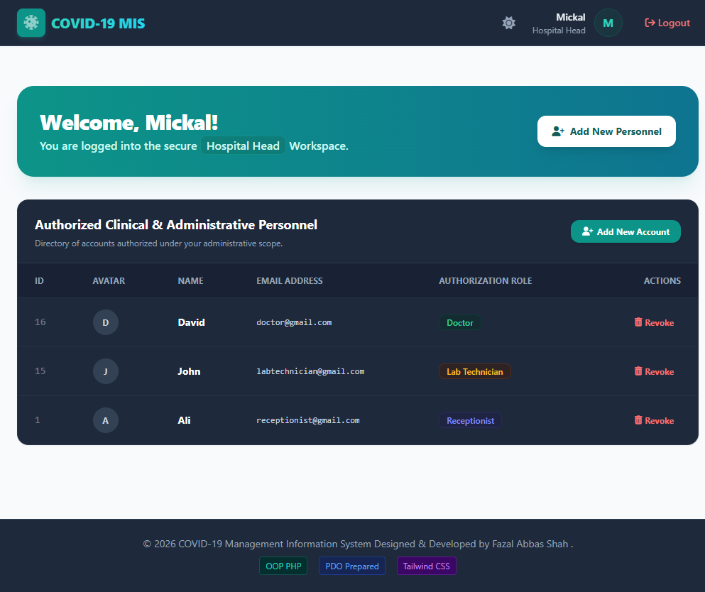

# 🦠 COVID-19 MIS (Management Information System)

A **COVID-19 Management Information System** built using **Object-Oriented PHP, PDO, MySQL, Tailwind CSS, and JavaScript**. The application provides secure authentication, role-based authorization, patient record management, and administrative dashboards through a responsive user interface.

This project was originally developed using procedural PHP and later refactored into an Object-Oriented architecture to improve maintainability, code organization, and reusability. It serves as a portfolio project demonstrating practical backend development skills without relying on PHP frameworks.

---

# 🧰 Technology Stack

| Category        | Technologies                    |
| --------------- | ------------------------------- |
| Backend         | PHP (Object-Oriented), PDO      |
| Database        | MySQL                           |
| Frontend        | HTML5, Tailwind CSS, JavaScript |
| Icons           | Font Awesome                    |
| Authentication  | PHP Sessions                    |
| Version Control | Git & GitHub                    |

---

# ✨ Features

* Secure user authentication
* Role-Based Access Control (RBAC)
* Patient record management
* User management system
* Administrative dashboards
* CRUD operations
* Responsive design
* Dark mode support
* Session-based authentication
* Password hashing and verification
* Prepared SQL statements using PDO
* Modular Object-Oriented architecture

---

# 🏗️ Architecture Overview

The project follows an Object-Oriented architecture where responsibilities are separated into reusable classes. Business logic, authentication, database access, and patient management are isolated from the presentation layer to improve readability and maintainability.

### Key Implementation Highlights

* **Object-Oriented PHP** – Business logic is organized into reusable classes such as `Database`, `Auth`, `User`, and `Patient`.
* **Autoloading** – Uses `spl_autoload_register()` to automatically load classes and reduce manual file inclusion.
* **Database Security** – Uses PDO prepared statements to help prevent SQL injection.
* **Authentication** – Session-based authentication with password verification and role validation.
* **Authorization** – Role-based access control restricts features according to user permissions.
* **Responsive UI** – Built with Tailwind CSS and supports light/dark mode.

---

# 📂 Project Structure

```text
├── classes/
│   ├── Database.php
│   ├── Auth.php
│   ├── User.php
│   └── Patient.php
│
├── includes/
│   ├── autoloader.php
│   ├── header.php
│   └── footer.php
│
├── index.php
├── login.php
├── logout.php
├── web.php
├── addnew.php
├── addUser.php
├── deleteUser.php
├── display.php
├── covidrecord_database.php
└── covidrecorddatabase.sql
```

The project structure separates business logic, reusable layouts, configuration files, and application pages, making the codebase easier to maintain and extend.

---

# 👥 User Roles & Permissions

The application supports seven user roles organized into two functional divisions.

## Clinical Division

Responsible for patient registration, diagnosis, and medical record management.

### Doctor

* Manage patient medical records
* Record vaccine information
* Update admission and discharge details



---

### Lab Technician

* Record diagnostic test results
* Update COVID variant classifications



---

### Receptionist

* Register patients
* Manage personal and contact information



---

## Administrative Division

Administrative users manage system accounts through a hierarchical authorization structure.

### Admin

* Full system access
* Manage all user roles





---

### Country Head

* Manage City Heads
* Manage Hospital Heads
* Manage Doctors
* Manage Lab Technicians
* Manage Receptionists



---

### City Head

* Manage Hospital Heads
* Manage Doctors
* Manage Lab Technicians
* Manage Receptionists



---

### Hospital Head

* Manage Doctors
* Manage Lab Technicians
* Manage Receptionists



---

# ⚙️ Installation

## 1. Clone the Repository

```bash
git clone <repository-url>
```

---

## 2. Create the Database

Open **phpMyAdmin** and create a database named:

```
covidrecorddatabase
```

Import the included SQL file:

```
covidrecorddatabase.sql
```

---

## 3. Configure the Project

Copy the project folder into your local server directory.

### XAMPP

```
C:/xampp/htdocs/
```

### WampServer

```
C:/wamp64/www/
```

---

## 4. Run the Application

Start Apache and MySQL.

Open:

```
http://localhost/covid-19-mis
```

---

# 🔑 Demo Accounts

The database includes sample accounts for testing.

| Role           | Email                                                     | Password              |
| -------------- | --------------------------------------------------------- | --------------------- |
| Admin          | [admin@gmail.com]         | adminpassword         |
| Country Head   | [countryhead@gmail.com]   | countryheadpassword   |
| City Head      | [cityhead@gmail.com]      | cityheadpassword      |
| Hospital Head  | [hospitalhead@gmail.com]  | hospitalheadpassword  |
| Doctor         | [doctor@gmail.com]        | doctorpassword        |
| Lab Technician | [labtechnician@gmail.com] | labtechnicianpassword |
| Receptionist   | [receptionist@gmail.com]  | receptionistpassword  |

> **Note:** The sample database supports legacy plaintext passwords for backward compatibility while also supporting secure password hashing for modern authentication.

---

# 💼 What This Project Demonstrates

This project was developed as part of my software development portfolio to demonstrate practical backend and full-stack web development skills using **Core PHP, MySQL, JavaScript, and Tailwind CSS** without relying on frameworks.

Key skills demonstrated through this application:

* Designing and developing Object-Oriented PHP applications
* Writing secure database queries using PDO prepared statements
* Implementing role-based authentication and authorization
* Structuring maintainable and reusable code
* Building responsive user interfaces with Tailwind CSS
* Developing complete CRUD functionality
* Managing MySQL databases and relational data
* Organizing projects using Git and GitHub

This project reflects my understanding of software architecture, secure backend development, database design, and responsive web application development. It represents the coding practices and technical skills I aim to bring to a junior PHP developer role.